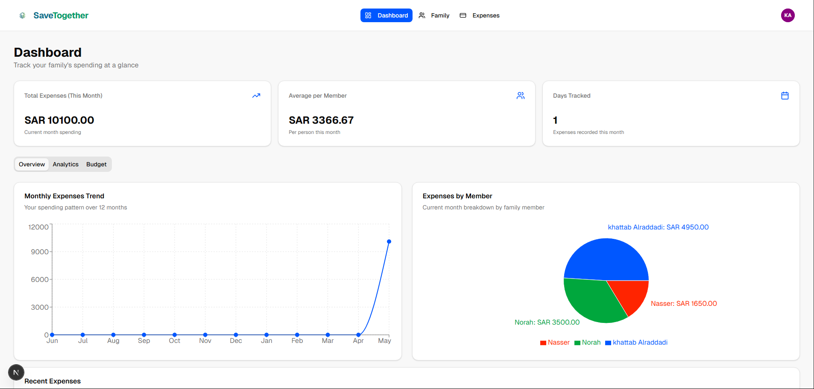
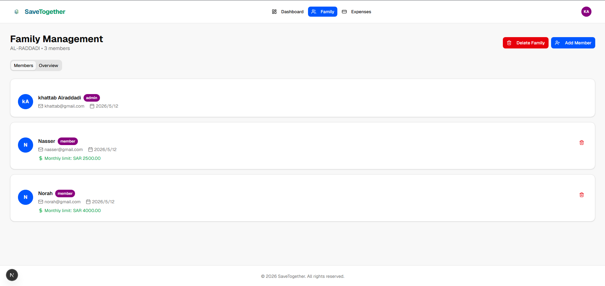
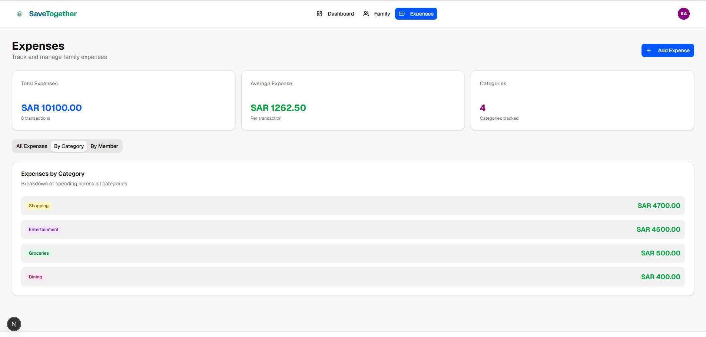
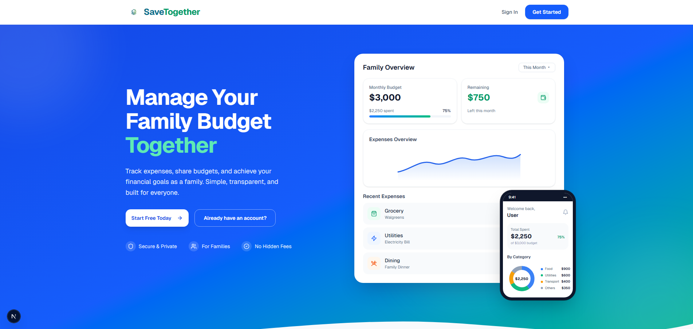

# SaveTogether: The Collaborative Family Finance Hub 💰👪

### "Manage Your Family Budget Together"

SaveTogether is a comprehensive full-stack web application developed as a graduation project to address the challenges of managing multi-person household finances. It provides a centralized, transparent platform where families can track spending, set financial goals, and achieve financial discipline together.

---

## 🌟 Visual Showcase

Here is a glimpse of the application's intuitive user interface:

### 1. The Power Dashboard (Admin View)
The primary overview for the family administrator (Parent). It tracks collective spending, per-member averages, and visualizes monthly trends and member contributions in a glance.

<p align="center">
  
</p>

### 2. Family Management & Budgeting
This page allows the Admin to manage family members (Admins or Members), set specific monthly spending limits for each individual (e.g., Norah: SAR 4000, Nasser: SAR 2500), and track when they joined.

<p align="center">
  
</p>

### 3. Detailed Expense Tracking & Categories
A view of all transactions, showing total expenses, average expense per transaction, and a detailed breakdown of spending by categories (e.g., Shopping, Entertainment, Groceries).

<p align="center">
  
</p>

### 4. Seamless Onboarding
The initial landing page introducing the application's core functions with a smooth "Manage Your Family Budget Together" call-to-action.

<p align="center">
  
</p>

---

## 🔥 Key Features

* **Role-Based Access Control:** Distinct roles for Admins (Parents) and Members (Children/Dependents).
* **Customizable Budgets:** Admins can set and update individual monthly budget limits for each family member.
* **Real-Time Spending Analytics:** Interactive data visualization (charts) on the dashboard to track total spending, averages, and historical trends.
* **Comprehensive Expense Logging:** A user-friendly system for logging and categorizing every transaction.
* **Categorized Spending Reports:** Breakdown of where money is spent across custom categories (Groceries, Entertainment, etc.).
* **Intelligent Overspending Alerts:** Automatic notifications and visual cues for both the Admin and Member when a member approaches or exceeds their monthly budget.

---

## 🛠️ Technology Stack

*(Please update this section with the exact technologies you used. Below is a common full-stack template)*

* **Backend:** [e.g., Python (Flask/Django)]
* **Frontend:** [e.g., React.js / Vue.js / HTML5/CSS3/JS]
* **Database:** [e.g., MySQL / PostgreSQL]
* **Data Visualization:** [e.g., Chart.js / D3.js]
* **Authentication:** [e.g., JWT (JSON Web Tokens)]

---

## 🚀 Installation & Setup (For Developers)

To run this project locally, follow these steps:

1.  **Clone the repository:**
    ```bash
    git clone [https://github.com/](https://github.com/)[YOUR-USERNAME]/SaveTogether-Family-Budget-Manager.git
    cd SaveTogether-Family-Budget-Manager
    ```
2.  **Install backend dependencies:**
    *(Example command, update as needed)*
    ```bash
    cd backend
    pip install -r requirements.txt
    ```
3.  **Install frontend dependencies:**
    *(Example command, update as needed)*
    ```bash
    cd ../frontend
    npm install
    ```
4.  **Set up the database:**
    *(Provide brief instructions on database migration or creation)*
5.  **Run the application:**
    *(Provide commands to start the backend and frontend servers)*

---

## 🎓 About the Developer

Developed as a Graduation Project for a Bachelor's Degree in Information Technology (IT).

---
*(If you do not want an Open Source license, you can remove this section)*
## ⚖️ License

This project is licensed under the MIT License - see the [LICENSE](LICENSE) file for details.
